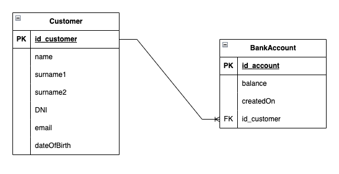

# Spring Boot, JPA/Hibernate, PostgreSQL and Swagger example 
In this example we are going to build a Spring Boot Rest CRUD API with Maven that use Spring Data JPA/Hibernate to interact with PostgreSQL database.
Also, we are going to document the REST API with Swagger 3 annotations.  
  
We will build a Rest CRUD API for an Account application in that:
- Each Account has autogenerated _userId, name, username, password, email_, and _createdOn_ date, according this table:   

- Apis provide CRUD operations (create, read, update, delete Accounts)
- Apis also support some custom finder methods such us find by name or by email domain

These are Apis that we provide:

| Methods | Urls                              | Actions                                                     |
|---------|-----------------------------------|-------------------------------------------------------------|
| GET     | /api/accounts[/:name]             | retrieve all accounts or the filter ones by name [optional] |
| GET     | /api/accounts/filter/:id          | retrieve an account by id                                   |
| GET     | /api/accounts/filter/:username    | retrieve an account by username                             |
| GET     | /api/accounts/filter/:email       | retrieve an account by email                                |
| GET     | /api/accounts/filter/:domain      | retrieve all accounts that match with email domain          |
| POST    | /api/accounts                     | add a new account                                           |
| PUT     | /api/accounts/update/username/:id | update account username with :id                            |
| PUT     | /api/accounts/update/email/:id    | update account email with :id                               |
| DELETE  | /api/accounts/delete/:id          | delete an account by :id                                    |
| DELETE  | /api/accounts/delete              | delete all accounts                                         |

We can try these endpoints through Swagger UI at: http://localhost:8080/accounts-management